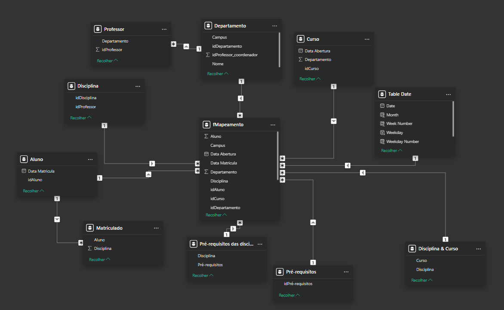

# 🌟 Desafio de Modelagem Dimensional – Star Schema

## 📝 Descrição do Desafio
O objetivo deste desafio é **criar um diagrama dimensional (star schema)** a partir de um diagrama relacional disponibilizado. O foco da análise será o **professor**, neste desafio foi estruturado um starschema considerando **dados relacionados a professores**, cursos ministrados e departamentos. 

### 🎯 Objetivo Principal
Montar a **tabela fato** e as **tabelas dimensão** para analisar dados relevantes sobre os professores. Além disso, será necessário **criar uma tabela dimensão de datas**, mesmo que o diagrama relacional original não forneça esses dados explicitamente.

### 🔍 O que precisa ser feito?
1. **Criar a Tabela Fato**:
   - A tabela fato deve conter **informações sobre professores** e outros elementos, como os cursos ministrados e os departamentos envolvidos.

2. **Criar as Tabelas Dimensão**:
   - As dimensões devem fornecer os **detalhes do contexto analisado** (professor, curso, departamento, etc.).

3. **Adicionar Tabela Dimensão de Datas**:
   - Suponha que você tem acesso aos dados e crie os **campos de data** necessários, como:
     - Data de oferta de disciplinas
     - Data de oferta dos cursos  
   - A granularidade das datas pode variar, de acordo com a necessidade da análise.

---

## 📂 Estrutura dos Arquivos
- **bd_desafio**: Base de dados relacional para modelagem.
- **desafio_star_schema.pbix**: Arquivo Power BI com o modelo construído.
- **star_schema.png**: Imagem do diagrama em estrela gerado.

---

## 🚀 Tecnologias e Ferramentas Utilizadas
- 🟢 **Power BI**   
- 🧮 **DAX** (Data Analysis Expressions)  
- 🔄 **Power Query**  
